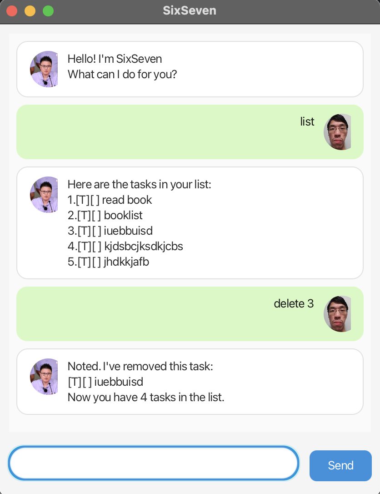

# SixSeven User Guide

**SixSeven** is a personal assistant chatbot that helps you track tasks. You can add todos, deadlines, and events, mark them done, and search for tasks.



## Quick Start

1. Run the application with `./gradlew run` (GUI) or run `SixSeven` for the text interface.
2. Type commands in the input field and press Send (GUI) or Enter (text).
3. Type `help` to see all available commands.
4. Type `bye` to exit.

## Features

### Viewing all tasks: `list`

Shows all tasks in your list with their status.

**Format:** `list`

**Example:**

```
list
```

**Expected output:**

```
Here are the tasks in your list:
1.[T][ ] read book
2.[D][ ] return book (by: Dec 01 2024)
3.[E][ ] project meeting (from: Mon 2pm /to 4pm)
```

### Searching tasks: `find`

Searches for tasks that contain the keyword in their description.

**Format:** `find <keyword>`

**Example:** `find book`

**Expected output:**

```
Here are the matching tasks in your list:
1.[T][ ] read book
2.[D][ ] return book (by: Dec 01 2024)
```

### Adding a todo: `todo`

Adds a task without any date.

**Format:** `todo <description>`

**Example:** `todo borrow book`

**Expected output:**

```
Got it. I've added this task:
[T][ ] borrow book
Now you have 4 tasks in the list.
```

### Adding a deadline: `deadline`

Adds a task with a due date. Use `yyyy-mm-dd` format for the date.

**Format:** `deadline <description> /by <yyyy-mm-dd>`

**Example:** `deadline return book /by 2024-12-15`

**Expected output:**

```
Got it. I've added this task:
[D][ ] return book (by: Dec 15 2024)
Now you have 5 tasks in the list.
```

### Adding an event: `event`

Adds a task with start and end times.

**Format:** `event <description> /from <from> /to <to>`

**Example:** `event team meeting /from Mon 2pm /to 4pm`

**Expected output:**

```
Got it. I've added this task:
[E][ ] team meeting (from: Mon 2pm /to 4pm)
Now you have 6 tasks in the list.
```

### Marking a task as done: `mark`

Marks the task at the given number as done.

**Format:** `mark <number>`

**Example:** `mark 2`

**Expected output:**

```
Nice! I've marked this task as done:
[D][X] return book (by: Dec 15 2024)
```

### Marking a task as not done: `unmark`

Marks the task at the given number as not done yet.

**Format:** `unmark <number>`

**Example:** `unmark 2`

### Deleting a task: `delete`

Removes the task at the given number from the list.

**Format:** `delete <number>`

**Example:** `delete 3`

**Expected output:**

```
Noted. I've removed this task:
[E][ ] team meeting (from: Mon 2pm /to 4pm)
Now you have 5 tasks in the list.
```

### Getting help: `help`

Shows a list of all available commands.

**Format:** `help`

### Exiting: `bye`

Exits the application.

**Format:** `bye`

**Expected output:**

```
Bye. Hope to see you again soon!
```
